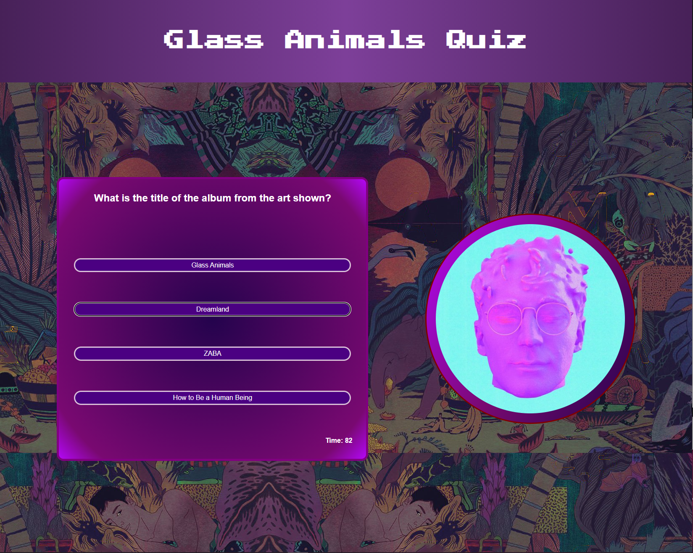

# code-quiz
## Jared Hector

https://jwhector.github.io/code-quiz/

This web app displays a welcome message notifying the user that by pressing "Start" a timed quiz will commence with questions involving the band Glass Animals. There are five questions in total, with images accompanying, including alt text for each image for accessibility purposes.

The HTML was semantically structured as best I could, with semantic tags and specific labeling. The biggest challenges faced during this project involved the interlacing of HTML, CSS, and JavaScript to create responsive buttons and satisfying user interaction.